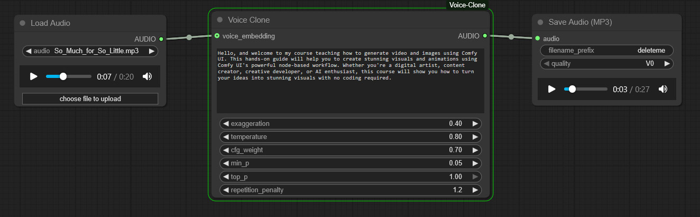

# ComfyUI Voice Clone

Custom TTS node that clones voice from a reference audio and speaks entered text.

## Install Voice Clone Custom Node

Install the custom node ComfyUI Voice Clone using your command/terminal prompt.

1. Navigate to your ComfyUI/custom_nodes folder.
2. Run,
   ```bash
   git clone https://github.com/Sean-Bradley/ComfyUI-Virtual-Webcam.git
   ```
3. Restart ComfyUI

## Install Models

All required models can be downloaded from [https://huggingface.co/ResembleAI/chatterbox/tree/main](https://huggingface.co/ResembleAI/chatterbox/tree/main)

Ensure that your folder structure and downloaded files resemble this below.

```text
--  ComfyUI/models/tts/chatterbox/
    |-- conds.pt
    |-- s3gen.safetensors
    |-- t3_cfg.safetensors
    |-- tokenizer.json
    |-- ve.safetensors
```

## Sample Workflow



## Sample Audios

| Play                                                                                                             | Download                                                        | Description                                                                                                                                                         |
| ---------------------------------------------------------------------------------------------------------------- | --------------------------------------------------------------- | ------------------------------------------------------------------------------------------------------------------------------------------------------------------- |
| <video controls width="300" height="50"><source src="./docs/So_Much_for_So_Little.mp3" type="audio/mpeg"></video> |    | Audio snippets assembled from [So Much for So Little](https://en.wikipedia.org/wiki/So_Much_for_So_Little) animated cartoon. Copyright © 1949 Warner Bros. Cartoons |
|                                                                                                                  |            | Audio snippets assembled from [Puss n' Booty](https://en.wikipedia.org/wiki/Puss_n%27_Booty) animated cartoon. Copyright © 1943 Warner Bros. Cartoons               |
|                                                                                                                  |  | Audio snippets assembled from [Scrap Happy Daffy](https://en.wikipedia.org/wiki/Scrap_Happy_Daffy) animated cartoon. Copyright © 1949 Warner Bros. Cartoons         |

## Settings

| Setting                    | Description                                                                                                                                                                                                                                                                                       |
| -------------------------- | ------------------------------------------------------------------------------------------------------------------------------------------------------------------------------------------------------------------------------------------------------------------------------------------------- |
| exaggeration               | Controls the expressiveness / prosody of the generated voice. Higher values make the speech more emphatic and varied; lower values produce a flatter, more neutral delivery. Valid range: 0.25 - 2.0.                                                                                             |
| temperature                | Sampling temperature for the text-to-speech decoder. Higher values increase randomness and variety in the generated audio; lower values make outputs more conservative and deterministic. Valid range: 0.15 - 2.0.                                                                                |
| cfg_weight                 | Classifier-free guidance (CFG) weight that balances adherence to the text conditioning vs. model priors. Larger values force the model to follow the conditioning (text/prompt) more strongly, which can improve faithfulness but may increase artifacts if set too high. Valid range: 0.05 - 1.0 |
| min_p                      | A lower-probability cutoff used during sampling to filter extremely unlikely tokens or frames. Helps avoid very low-probability outputs that could degrade quality. Valid range: 0.0 - 1.0                                                                                                        |
| top_p                      | Nucleus (top-p) sampling cumulative probability threshold. The decoder samples from the smallest set of tokens whose cumulative probability ≥ top_p. top_p = 1.0 disables nucleus filtering (i.e., sample from full distribution). Valid range: 0.0 - 1.0                                         |
| repetition_penalty         | Penalizes repetition during generation. Values > 1.0 discourage repeating the same tokens/frames, reducing looping/redundancy in speech. Valid range: 1.0 - 2.0                                                                                                                                   |
| voice_embedding (optional) | If provided, an audio reference is used as an audio prompt for voice cloning.                                                                                                                                                                                                                     |

## About

This custom node uses [resemble-ai/chatterbox](https://github.com/resemble-ai/chatterbox) under the hood.
