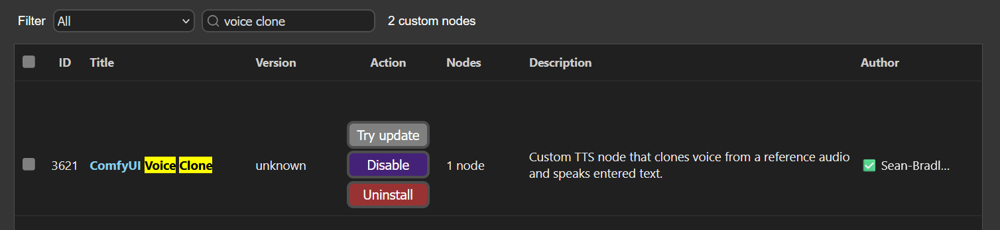
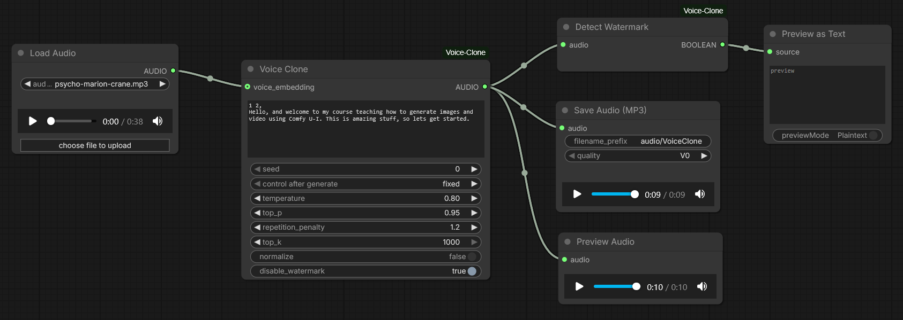
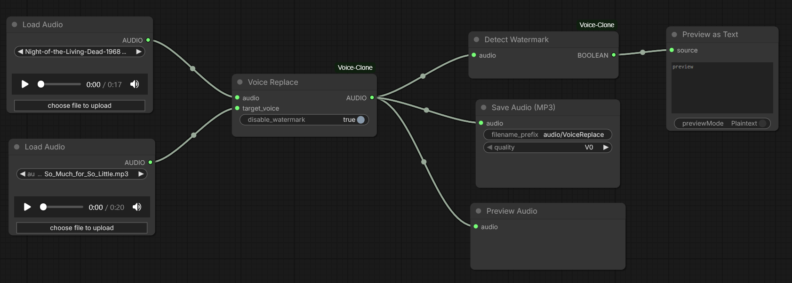

# ComfyUI Voice Clone

Custom TTS node that clones voice from a reference audio and speaks entered text.

## Install Voice Clone Custom Node

Install the ComfyUI Voice Clone custom node using the manager,



Or, install using your command/terminal prompt.

1. Navigate to your `ComfyUI/custom_nodes` folder.
2. Run,
   ```bash
   git clone https://github.com/Sean-Bradley/ComfyUI-Voice-Clone.git
   ```
3. Navigate to your `ComfyUI_windows_portable` folder.
4. Run,
   ```bash
   python_embeded\python -m pip install -r ComfyUI/custom_nodes/comfyui-voice-clone/requirements.txt
   ```
5. Restart ComfyUI

## Install Models

All required models can be downloaded from [https://huggingface.co/ResembleAI/chatterbox/tree/main](https://huggingface.co/ResembleAI/chatterbox/tree/main)

Ensure that your folder structure and downloaded files resemble this below.

```text
📂 ComfyUI/
├── 📂 models/
│   ├── 📂 tts/
│   │   └── 📂 chatterbox/
|   |       ├── added_tokens.json
|   |       ├── conds.pt
|   |       ├── merges.txt
|   |       ├── s3gen.safetensors
|   |       ├── s3gen_meanflow.safetensors
|   |       ├── special_tokens_map.json
|   |       ├── t3_turbo_v1.safetensors
|   |       ├── tokenizer_config.json
|   |       ├── ve.safetensors
|   |       └── vocab.json
```

## Example Workflow Layouts

### Voice Clone

Download <a href="../docs/example-voice-clone.mp3" download style="white-space: nowrap">Example Voice Clone</a> and drag into ComyfUI to see the workflow.



### Voice Replace

Download <a href="../docs/example-voice-replace.mp3" download style="white-space: nowrap">Example Voice Replace</a> and drag into ComyfUI to see the workflow.



## Sample Audios

| Download                                                                              | Description                                                                                                                                                         |
| ------------------------------------------------------------------------------------- | ------------------------------------------------------------------------------------------------------------------------------------------------------------------- |
| [So_Much_for_So_Little.mp3](docs/So_Much_for_So_Little.mp3)                           | Audio snippets assembled from [So Much for So Little](https://en.wikipedia.org/wiki/So_Much_for_So_Little) animated cartoon. Copyright © 1949 Warner Bros. Cartoons |
| [puss-n-booty-lady.mp3](docs/puss-n-booty-lady.mp3)                                   | Audio snippets assembled from [Puss n' Booty](https://en.wikipedia.org/wiki/Puss_n%27_Booty) animated cartoon. Copyright © 1943 Warner Bros. Cartoons               |
| [scrap-happy-daffy-duck.mp3](docs/scrap-happy-daffy-duck.mp3)                         | Audio snippets assembled from [Scrap Happy Daffy](https://en.wikipedia.org/wiki/Scrap_Happy_Daffy) animated cartoon. Copyright © 1949 Warner Bros. Cartoons         |
| [Night of the Living Dead 1968 (man)](docs/Night-of-the-Living-Dead-1968-man.mp3)     | Audio snippets assembled from [Night of the Living Dead (1968)](https://en.wikipedia.org/wiki/Night_of_the_Living_Dead). Copyright © 1968 Image Ten, Inc            |
| [Night of the Living Dead 1968 (woman)](docs/Night-of-the-Living-Dead-1968-woman.mp3) | Audio snippets assembled from [Night of the Living Dead (1968)](https://en.wikipedia.org/wiki/Night_of_the_Living_Dead). Copyright © 1968 Image Ten, Inc            |
| [Psycho (Norman Bates)](docs/psycho-norman-bates.mp3)                                 | Audio snippets assembled from [Psycho (1960)](<https://en.wikipedia.org/wiki/Psycho_(1960_film)>). Copyright © 1960 Shamley Productions, Inc.                       |
| [Psycho (Marion Crane)](docs/psycho-marion-crane.mp3)                                 | Audio snippets assembled from [Psycho (1960)](<https://en.wikipedia.org/wiki/Psycho_(1960_film)>). Copyright © 1960 Shamley Productions, Inc.                       |

## Settings

| Setting                    | Description                                                                                                                                                                                                                                               |
| -------------------------- | --------------------------------------------------------------------------------------------------------------------------------------------------------------------------------------------------------------------------------------------------------- |
| temperature                | Sampling temperature for the text-to-speech decoder. Higher values increase randomness and variety in the generated audio; lower values make outputs more conservative and deterministic. Valid range: 0.15 - 2.0.                                        |
| top_p                      | Nucleus (top-p) sampling cumulative probability threshold. The decoder samples from the smallest set of tokens whose cumulative probability ≥ top_p. top_p = 1.0 disables nucleus filtering (i.e., sample from full distribution). Valid range: 0.0 - 1.0 |
| repetition_penalty         | Penalizes repetition during generation. Values > 1.0 discourage repeating the same tokens/frames, reducing looping/redundancy in speech. Valid range: 1.0 - 2.0                                                                                           |
| voice_embedding (optional) | If provided, an audio reference is used as an audio prompt for voice cloning.                                                                                                                                                                             |
| top_k                      | At each step of generation, the model predicts probabilities for many possible next tokens (text or acoustic tokens). The next token is sampled only from those top k candidates.                                                                         |
| normalize                  | Normalize the audio output volume.                                                                                                                                                                                                                        |
| disable_watermark          | By default, audio output is watermarked using PerTh Watermarking. You can disable this by selecting `true`.                                                                                                                                               |

## About

This custom node uses [resemble-ai/chatterbox](https://github.com/resemble-ai/chatterbox) under the hood.

<!--
[angry]         ? none of these question marks seem to work
[fear]          ?
[surprised]     ?
[whispering]    ?
[advertisement] ?
[dramatic]      ? causes very slow generation
[narration]     ? causes very slow generation
[crying]        ?
[happy]         ? i think so
[sarcastic]     ?
[clear throat]  yes
[sigh]          yes causes very slow generation
[shush]         yes
[cough]         yes
[groan]         yes
[sniff]         yes
[gasp]          yes
[chuckle]       yes
[laugh]         yes
-->
